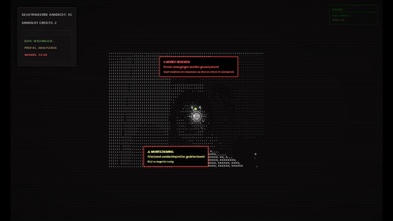
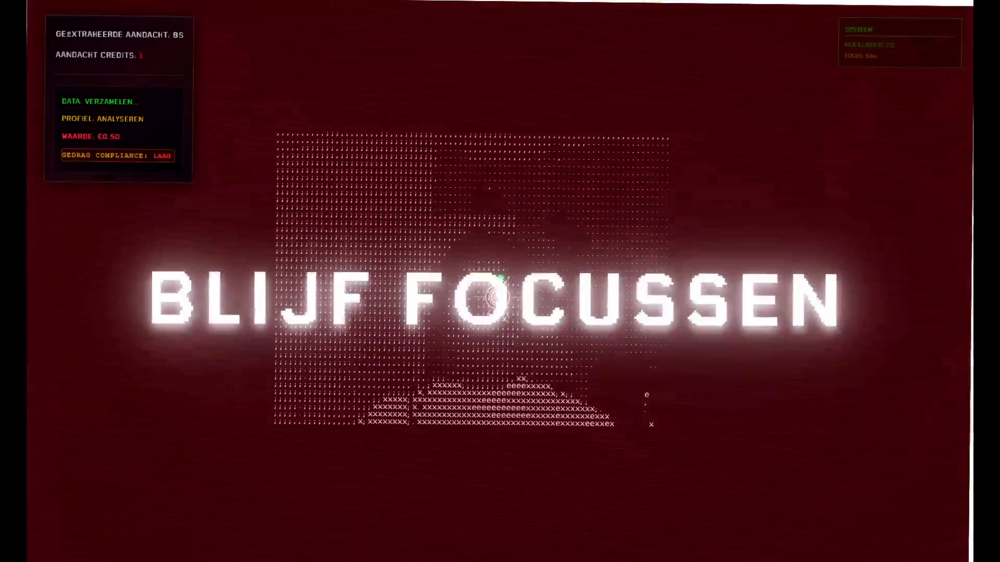
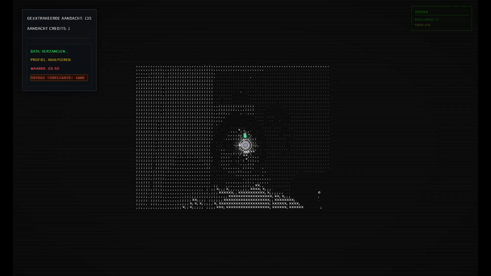
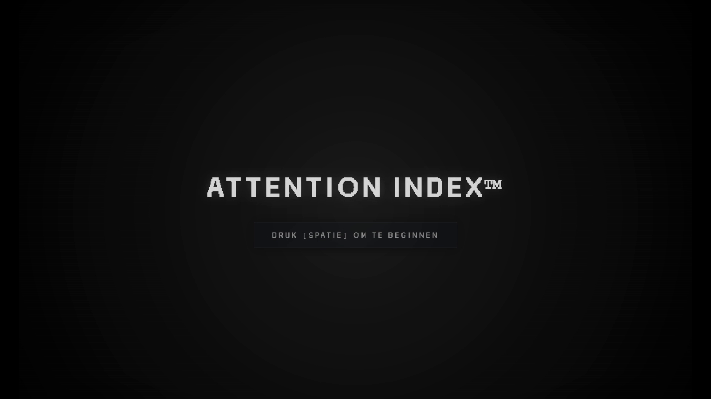

# 👁️ Attention Index™

<!-- Demo gif as banner -->
[](https://youtu.be/qHU2RhDsgqM)

### [Bekijk de demo video](https://youtu.be/qHU2RhDsgqM)

## Disclaimer
Deze inhoud kan flitsende lichten, jumpscares en beelden bevatten die epileptische aanvallen of schrikreacties kunnen veroorzaken.

## Inleiding

Stel je een wereld voor waarin je blik nooit meer vrij is. Een systeem dat je ogen volgt, elke seconde meet waar jouw focus heen gaat en die informatie vasthoudt alsof het goud is. Je mag niet wegkijken. Nooit. Attention Index™ is dat systeem. Het vraagt constant om jouw aandacht en laat je ervaren hoe het voelt om door technologie gevangen te worden in een voortdurende uitwisseling van blik en controle.

## Concept

Attention Index™ is een interactieve installatie die de blik van de bezoeker volgt en die blik realtime omzet in ASCII visuals. De installatie voelt licht dystopisch: het systeem vraagt constant om aandacht en laat zien hoe digitale systemen onze focus claimen. Ik vertel niet alles. De installatie schetst een wereld waarin aandacht een valuta is, zodat bezoekers zelf verbindingen kunnen leggen.

## Kort overzicht

- Input: eye tracking via webcam
- Output: live ASCII art die reageert op waar je kijkt
- Doel: een visuele en ervaringsgerichte reflectie op aandacht en technologie

## Wat je nodig hebt

- Python 3.11
- Node.js 16+
- Webcam (externe USB webcam aanbevolen)
- Webbrowser

## Snelle installatie

1. Repository clonen

```bash
git clone https://github.com/marino2003/Attention-Index-.git
cd attention-index
```

2. Automatisch installeren (Windows)

```cmd
install.bat
```

3. Start de installatie

```cmd
start-servers.bat
```

Als je geen `install.bat` hebt, installeer handmatig: maak een Python venv, `pip install -r requirements.txt`, en `npm install` voor de frontend.

## Kort gebruik

1. Start backend en frontend
2. Selecteer je camera in het setupscherm
3. Volg de kalibratie-instructies op het scherm
4. Kijk naar verschillende plekken en zie hoe de ASCII visuals reageren

## Media

### Live Demo

<p align="center">
  
</p>

### Screenshots

<div align="center">

| Blijf focussen... | ASCII Art Generation | Start Screen |
|:---------------:|:-------------------:|:--------------:|
|  |  |  |

</div>


## Basale structuur

```
backend/        # Python code voor camera en tracking
frontend/       # JS code voor rendering en UI
```

## Code Architectuur & Kernfunctionaliteit

### 🏗️ Modulaire Applicatie Architectuur

De installatie bestaat uit een modulair systeem waarbij elk onderdeel onafhankelijk werkt:

```javascript
// src/main.js - Hoofdklasse die alle modules samenbrengt
class FocusTuin {
  constructor() {
    // Core systemen
    this.applicatie = null;
    this.interfaceManager = null;
    this.schermController = null;
    this.schermFlowManager = null;
    
    this.setupGlobalAccess();
    this.initialiseerMetStartScherm();
  }
  
  async initialiseerHoofdApplicatie() {
    // Initialiseer core applicatie EERST
    this.applicatie = new FocusTuinApplicatie();
    await this.applicatie.initialiseer();
    
    // Initialiseer UI systemen MET de applicatie referentie
    this.interfaceManager = new InterfaceManager(this.applicatie);
    this.schermController = new SchermController();
  }
}
```

### 👁️ Real-time Eye Tracking Systeem

De eye tracking werkt via een hybride systeem met Python backend en JavaScript frontend:

```javascript
// src/oogtracking/detectie.js - WebSocket verbinding met Python backend
export class OogDetectie {
  async verbindMetBackend() {
    // Maak WebSocket verbinding
    this.socket = io(this.backendUrl);
    
    // Ontvang gaze data van Python backend
    this.socket.on('gaze_data', (data) => {
      this.verwerkOogData({
        x: data.x,
        y: data.y,
        confidence: data.confidence || 1.0
      }, data.timestamp || Date.now());
    });
    
    // ASCII webcam frames voor face manipulation
    this.socket.on('ascii_webcam_frame', (frameData) => {
      this.handleWebcamFrameForASCII(frameData);
    });
  }
}
```

```python
# backend/core/oog_detectie.py - MediaPipe Face Mesh voor iris detectie
class OogDetectie:
    def __init__(self):
        # MediaPipe Face Mesh setup met strikte detectie parameters
        self.face_mesh = self.mp_face_mesh.FaceMesh(
            max_num_faces=1,
            refine_landmarks=True,
            min_detection_confidence=CAMERA_CONFIG['detection_confidence'],
            min_tracking_confidence=CAMERA_CONFIG['tracking_confidence']
        )
        
    def bereken_gaze_richting(self, linker_centrum, rechter_centrum, mesh_punten, frame_breedte, frame_hoogte):
        # Bereken relatieve iris positie binnen elk oog
        linker_rel_x = (linker_centrum[0] - linker_oog_centrum[0]) / 30.0
        rechter_rel_x = (rechter_centrum[0] - rechter_oog_centrum[0]) / 30.0
        
        # Gemiddelde relatieve positie
        gem_rel_x = (linker_rel_x + rechter_rel_x) / 2
        gem_rel_y = (linker_rel_y + rechter_rel_y) / 2
        
        # Pas kalibratie en schaling toe
        gecalibreerde_x = gem_rel_x * self.gaze_schaal_x + self.kalibratie_offset_x
        gecalibreerde_y = gem_rel_y * self.gaze_schaal_y + self.kalibratie_offset_y
        
        return abs_x, abs_y
```

### 🎯 Focus Zone Detectie Systeem

De focus zone gebruikt een gecentraliseerde configuratie voor zowel detectie als visuele weergave:

```javascript
// src/core/focus_zone_config.js - Strikte focus zone instellingen
export const FOCUS_ZONE_CONFIG = {
  detection: {
    // Extreem strikte detectie zone
    horizontaleTolerantie: 20,    // Slechts 20px horizontaal
    verticaleTolerantie: 15,      // Slechts 15px verticaal
    
    // Hysterese voorkomt flikkering
    focusHysterese: 10,
    verticaleHysterese: 8,
    
    // Timing voor stabiliteit
    stabilisatieTijd: 300,
    minimaleConfidence: 0.6
  },
  
  visual: {
    // Visuele ringen die detectie zone tonen
    basisStraal: 20,
    rings: {
      buitenste: 1.4,  // Tolerance boundary (28px)
      middelste: 1.2,   // Reference ring
      binnenste: 1.0    // Visual center (20px)
    }
  }
};
```

### 🎨 ASCII Art Face Manipulation

De webcam feed wordt real-time omgezet naar ASCII art die reageert op je blik:

```javascript
// src/tuin/ascii_kunst.js - Face manipulation door eye tracking
export class ASCIIKunst {
  constructor(zaadGetal) {
    // Face manipulation componenten
    this.webcamProcessor = new WebcamProcessor(this);
    this.gazeManipulator = new GazeManipulator(this);
    this.faceDistorter = new FaceDistorter(this);
    this.asciiEffecten = new ASCIIEffecten(this);
  }
  
  processWebcamFrameFromBackend(frameData) {
    this.webcamProcessor.processFrame(frameData);
  }
  
  generateManipulatedFrame() {
    // Start met webcam fundament
    this.asciiCanvas = this.webcamProcessor.getFoundationLayer();
    
    // Pas gaze-gebaseerde face manipulation toe
    if (this.isVisible && this.laatsteGazePositie) {
      this.asciiCanvas = this.faceDistorter.manipulateFace(
        this.asciiCanvas, 
        this.laatsteGazePositie
      );
    }
    
    // Voeg ASCII effecten toe
    const focusData = {
      isFocus: this.isVisible,
      gazeX: this.laatsteGazePositie.x,
      gazeY: this.laatsteGazePositie.y,
      intensiteit: this.gazeManipulator.getFocusIntensity()
    };
    
    this.asciiCanvas = this.asciiEffecten.verwerkEffecten(this.asciiCanvas, focusData);
  }
}
```

### 🎭 Event-Driven Communicatie

Alle modules communiceren via een event systeem voor loose coupling:

```javascript
// src/core/gebeurtenissen.js - Centraal event management
class GebeurtenisManager {
  voegListenerToe(gebeurtenisNaam, callback) {
    if (!this.listeners[gebeurtenisNaam]) {
      this.listeners[gebeurtenisNaam] = [];
    }
    this.listeners[gebeurtenisNaam].push(callback);
  }
  
  verstuurGebeurtenis(gebeurtenisNaam, data = null) {
    if (this.debugModus) {
      console.log(`📡 Event: ${gebeurtenisNaam}`, data);
    }
    
    if (this.listeners[gebeurtenisNaam]) {
      this.listeners[gebeurtenisNaam].forEach(callback => {
        try {
          callback(data);
        } catch (error) {
          console.error(`Error in event listener voor ${gebeurtenisNaam}:`, error);
        }
      });
    }
  }
}
```

### 🖥️ Scherm Flow Management

De installatie heeft een gestructureerde flow: Start → Tutorial → Hoofdervaring:

```javascript
// src/screens/scherm_flow_manager.js
export class SchermFlowManager {
  async startFlow() {
    // Altijd starten vanaf start scherm
    this.huidigeScherm = 'start';
    this.startScherm = new StartScherm();
    await this.startScherm.toon();
    
    // Luister naar scherm transities
    gebeurtenisManager.voegListenerToe('startSchermVoltooid', () => {
      this.gaaNaarTutorial();
    });
    
    gebeurtenisManager.voegListenerToe('tutorialSchermVoltooid', () => {
      this.hoofdApplicatie.startHoofdErvaring();
    });
  }
}
```

Deze modulaire architectuur zorgt ervoor dat elk onderdeel onafhankelijk kan worden ontwikkeld en getest, terwijl ze samen een coherente gebruikerservaring vormen.


## License

Creative Commons Attribution-ShareAlike 4.0 International (CC BY-SA 4.0)

---